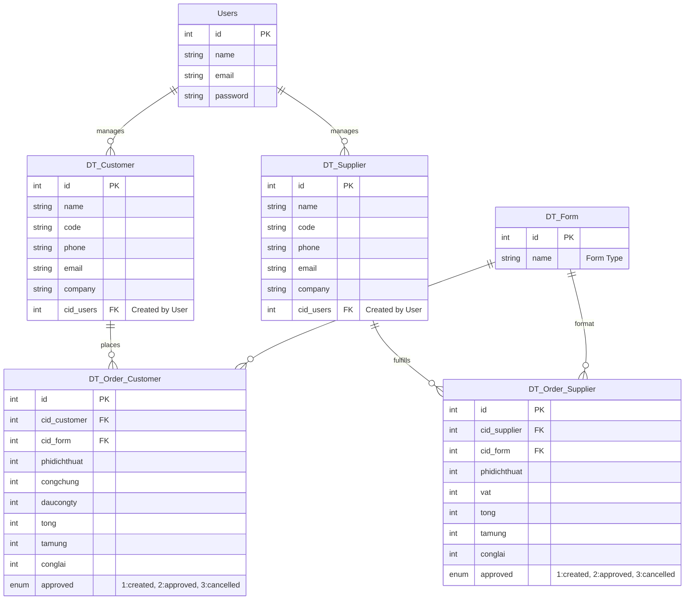

# Database Structure (`dpadmin`)

## 1. Entity-Relationship Diagram (ERD)

## 2. Core Tables Description

### `DT_Customer` & `DT_Supplier`
These tables manage the profiles of Clients (Khách Hàng) and Freelancers/Agencies (Nhà Cung Cấp).
- Linked to `users` via `cid_users` to track which admin created the record.

### `DT_Order_Customer`
Represents customer requests for document translation, notarization, and related services.
- Tracks granular service costs natively in the row (e.g., `phidichthuat` for translation fee, `congchung` for notarization fee).
- Computes `tong` (total), tracks `tamung` (advance payment), and `conglai` (remaining balance).

### `DT_Order_Supplier`
Represents the subcontracted tasks sent to suppliers/freelancers. Follows a similar structure to Customer orders but strictly manages supplier payables.

### `users`
Standard Laravel authentication table for system administrators.

### `DT_Log`
System activity log table referenced by various controllers to track modifications and state changes within the application endpoints.
