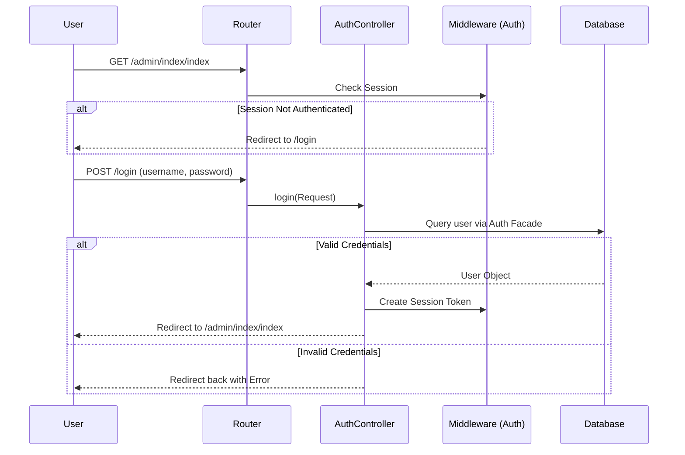
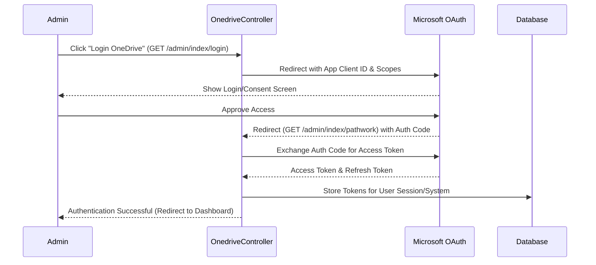
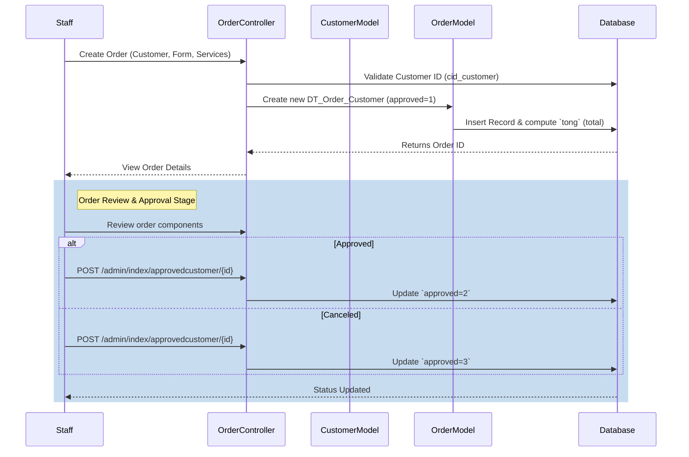

# Sequence Diagrams

## 1. User Authentication Flow

```mermaid
sequenceDiagram
    participant User
    participant Router
    participant AuthController
    participant Middleware (Auth)
    participant Database

    User->>Router: GET /admin/index/index
    Router->>Middleware (Auth): Check Session
    alt Session Not Authenticated
        Middleware (Auth)-->>User: Redirect to /login
    end
    User->>Router: POST /login (username, password)
    Router->>AuthController: login(Request)
    AuthController->>Database: Query user via Auth Facade
    alt Valid Credentials
        Database-->>AuthController: User Object
        AuthController->>Middleware (Auth): Create Session Token
        AuthController-->>User: Redirect to /admin/index/index
    else Invalid Credentials
        AuthController-->>User: Redirect back with Error
    end
```

## 2. OneDrive Integration Authentication

```mermaid
sequenceDiagram
    participant Admin
    participant OnedriveController
    participant Microsoft OAuth
    participant Database

    Admin->>OnedriveController: Click "Login OneDrive" (GET /admin/index/login)
    OnedriveController->>Microsoft OAuth: Redirect with App Client ID & Scopes
    Microsoft OAuth-->>Admin: Show Login/Consent Screen
    Admin->>Microsoft OAuth: Approve Access
    Microsoft OAuth-->>OnedriveController: Redirect (GET /admin/index/pathwork) with Auth Code
    OnedriveController->>Microsoft OAuth: Exchange Auth Code for Access Token
    Microsoft OAuth-->>OnedriveController: Access Token & Refresh Token
    OnedriveController->>Database: Store Tokens for User Session/System
    OnedriveController-->>Admin: Authentication Successful (Redirect to Dashboard)
```

## 3. Order Processing Flow (Customer)

```mermaid
sequenceDiagram
    participant Staff
    participant OrderController
    participant CustomerModel
    participant OrderModel
    participant Database

    Staff->>OrderController: Create Order (Customer, Form, Services)
    OrderController->>Database: Validate Customer ID (cid_customer)
    OrderController->>OrderModel: Create new DT_Order_Customer (approved=1)
    OrderModel->>Database: Insert Record & compute `tong` (total)
    Database-->>OrderController: Returns Order ID
    OrderController-->>Staff: View Order Details
    
    rect rgb(200, 220, 240)
        Note right of Staff: Order Review & Approval Stage
        Staff->>OrderController: Review order components
        alt Approved
            Staff->>OrderController: POST /admin/index/approvedcustomer/{id}
            OrderController->>Database: Update `approved=2`
        else Canceled
            Staff->>OrderController: POST /admin/index/approvedcustomer/{id}
            OrderController->>Database: Update `approved=3`
        end
        Database-->>Staff: Status Updated
    end
```
